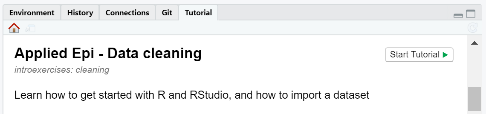
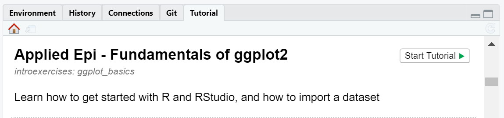
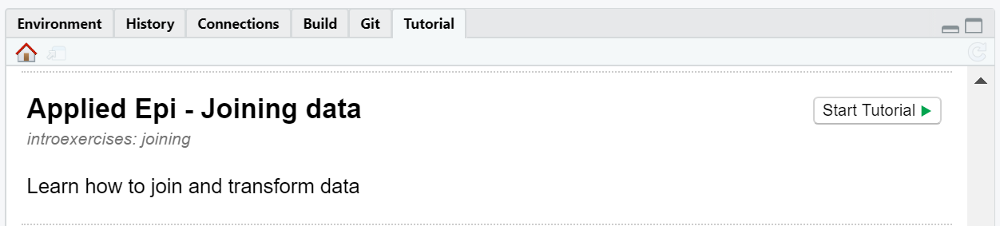

<!-- README.md is generated from README.Rmd. Please edit that file -->

# Introduction to R for Applied Epidemiology

[This website](https://appliedepi.github.io/intro_course) hosts training
materials for “Introduction to R for Applied Epidemiologists”. This
course teaches the fundamentals of R for applied epidemiologists and
public health practitioners.

[**Applied Epi**](www.appliedepi.org) is a nonprofit organization
supporting frontline practitioners through open-course analytical tools,
training, and support. Our [Epidemiologist R
Handbook](www.epirhandbook.com) is a free R reference manual which has
been used by 130,000 people around the world.

# Course outline

Click here to download the course outline (PDF) TODO

# Course folder and case study data

[Click
here](https://minhaskamal.github.io/DownGit/#/home?url=https://github.com/appliedepi/intro_course/tree/main/intro_course)
to download a zipped folder to use in the course exercises.

**Unzip the folder and save it on your computer (not on a shared
drive).** You will receive further instructions in the course.

# Course exercises

The course utilizes the R package {learnr} to provide interactive
exercises *within* your RStudio window. To access these custom
exercises, follow these instructions:

1)  Set up R and RStudio (we will provide instructions and
    troubleshooting before the course)

2)  Run these commands in your R console:  
    `install.packages("remotes")`

3)  Run this command in your R console:  
    `remotes::install_github("appliedepi/introexercises", dep = TRUE, force = TRUE)`  
    Follow any prompted instructions regarding necessary updates

4)  To open an exercise, Click on the “Tutorial” tab in the upper-right
    RStudio pane (which also contains a tab holding your R
    Environment).  

-   The first time, you may need to restart RStudio for the tutorials to
    appear.

5)  Select the exercise for your current course module - look for the
    name “Applied Epi -”.  

-   You can proceed with the exercise in this pane, or click the small
    icon to expand this tutorial into a separate window.  
-   Watch the gif below. The exercise will provide sample code that you
    can run from your R script.  
-   Return to the exercise to answer quiz questions and proceed to the
    next section of the exercise.

# Course materials

<!-- badges: start -->
<!-- badges: end -->

THESE ARE DRAFTS

## Module 1: Introduction to R

We welcome you to the course and dive into the basics of how to interact
with R and RStudio, basic R syntax, and how to organize your analytical
projects. Finally, we cover R functions and packages, and introduce the
core functions used to import data. Using these, we import the Ebola
case study surveillance linelist, and begin to inspect and review it.

-   [Slides: Welcome, course logistics, RStudio, and basic R
    syntax](https://appliedepi.github.io/intro_course/modules/module_1/slides/course_introduction/slides_course_introduction.html)

-   Live demonstration ([instructor
    guide](https://appliedepi.github.io/intro_course/modules/module_1/guides/rstudio_tour.html))

-   Exercise:

## Module 2: Data cleaning

Now that we have our surveillance linelist in R, we cover what “data
cleaning” steps are necessary and how to execute these in R. Along the
way, we introduce many of the core R functions including adjusting
column names, deduplicating and filtering rows, selecting and modifying
columns, recoding values, and more. Together, we write a sequence of
“pipes” to clean the linelist step-by-step in a clear, reproducible
manner… so that our dataset is ready for preliminary analysis!

-   [Slides: Tidy data and data
    cleaning](https://appliedepi.github.io/intro_course/modules/module_2/slides/slides_cleaning_dplyr/slides_cleaning_dplyr.html)

-   Exercise:

## Module 3: Grouping data and making summary tables

Informative tables are the bedrock of epidemiological and public health
practice. In this module we introduce three tools to produce tables of
summary statistics: {dplyr} for flexibility, {janitor} for speed, and
{gtsummary} for beauty. Finally, we explore {flextable}, which can be
used to beautiful any of the above approaches, add selecting colors and
highlights, and save tables to Word, PNG, HTML, etc.

-   [Slides: Grouping and summarizing
    data](https://appliedepi.github.io/intro_course/modules/module_3/slides/slides_summary_tables/slides_grouping_summaries.html)

-   Exercise:

## Module 4: Data visualization with {ggplot2}

Using the {ggplot2} package to maximum effect rests upon understanding
how to apply its “grammar of graphics” to build a plot layer-by-layer.
We tackle this piece-by-piece, introducing concepts one-by-one so that
you build upon previous knowledge to construct informative and colorful
bar plots, scatter plots, histograms, line plots, text labels that
automatically update with refreshed data (very useful for
epidemiological reports!), and more.

-   [Slides: Data visualization with
    ggplot2](https://appliedepi.github.io/intro_course/modules/module_4/slides/slides_ggplot_basics/slides_ggplot_basics.html)

-   Exercise:

-   [Slides: Scales, themes, and
    labels](https://appliedepi.github.io/intro_course/modules/module_4/slides/slides_ggplot_scales_labels/slides_ggplot_scales_labels.html)

-   Exercise:

## Module 5: Transforming data

Public health analytics rarely involves just one data set, so now we
practice joining data by adding hospital, laboratory, and case
investigation data to our surveillance linelist. We engrain best
practices for conducting joins, and prepare your for doing data
transformations independently. In the second part of this module, we
address *pivoting*, which in R means transforming data between “long”
and “wide” formats. This is particularly relevant in public health,
where each format has distinct benefits.  
- [Slides: Joining
data](https://appliedepi.github.io/intro_course/modules/module_5/slides/slides_joins/slides_joins.html)

-   Exercise:

-   [Slides: Pivoting
    data](https://appliedepi.github.io/intro_course/modules/module_5/slides/slides_pivots/slides_pivots.html)

-   Exercise:

## Module 6: More data visualization with {ggplot2}

In this second data visualization module we encourage you to practice
learning R independently (a necessary skill once you leave the class!)
but with our support. We jump in to tackle visualizations that are
central to descriptive epidemiology: the intricacies of crafting an
accurate epidemic curve, conveying three continuous variables with a
heat plot, and creating age/sex pyramids to convey demographics.

-   [Slides: Epidemic curves in ggplot2]() TODO  
-   [Slides: Heat plots in ggplot2]() TODO  
-   [Slides: Age/sex pyramids in ggplot2]() TODO  
-   [Slides: GIS
    demonstration](https://appliedepi.github.io/intro_course/modules/module_6/slides/slides_gis_demo/slides_gis_demo.html)

## Module 7: Routine reports with R Markdown

In this module, we take the R code on the Ebola case study that you have
been building throughout the course and convert it into a reproducible,
automated report (Word, PDF, HTML, etc.). We teach you the variations in
syntax and opportunties that lie in being able to produce documents that
update when incoming data is refreshed, that look professional, and can
be sent to inform public health parters and stakeholders.

-   Live demonstration [Instructor
    guide](https://appliedepi.github.io/intro_course/modules/module_7/slides/demo_rmd/demo_rmd_guide.html)

-   [Slides: R markdown and routine
    reports](https://appliedepi.github.io/intro_course/modules/module_7/slides/slides_rmd/slides_rmd.html)

-   Exercise:

## Module 8: Final exercise and code review

In this last module, your skills are tested as you have to produce an R
Markdown report using a COVID-19 case linelist. Unlike with the Ebola
case study, you will not have the answer code available to you. When you
finish, we perform “code reviews”, simultaneously improving your coding
skills and teaching you how to review others’ code. Before closing, we
touch upon how to find your particular community of R users, resources
available to you for questions, and close with a feedback survey.

-   [Slides: COVID case study]() TODO  
-   [Slides: Code review]() TODO

## Sustained support

Our instructors *know* public health. One of the signature features of
Applied Epi’s training is that we provide follow-up support to your
team, to help you apply your new skills to your work context. We
schedule 1.5-hour sessions with your team at 1 week, 2 weeks, 1 month, 2
months, and 3 months post-training. In these sessions, we help you
troubleshoot code, advise you on analytical strategies, or guide you in
new learning that you need.

## Notes

-   Please note that all of our case study training materials use *fake
    example data* in which no person is identifiable and the actual
    values have been scrambled.  
-   Modifications are possible so that the course uses data from *your*
    jurisdiction. Email us at <contact@appliedepi.org> us to discuss.

# Acknowledgements

Authors and contributors to the curriculum from **Applied Epi**
included:

-   Neale Batra  

-   Mathilde Mousset  

-   Arran Hamlet  

-   Alex Spina  

-   Paula Blomquist  

-   …

-   The Fulton County Board of Health graciously provided example data
    (anonymized and scrambled) for a case study.  

-   The {outbreaks} package formed the basis for the fake dataset in the
    Ebola case study.

# Terms of Use and License

 This
work is licensed under a
<a rel="license" href="http://creativecommons.org/licenses/by-nc-sa/4.0/">Creative
Commons Attribution-NonCommercial-ShareAlike 4.0 International
License</a>.

Please email <contact@appliedepi.org> if you could like to use these
materials for an academic course or epidemiologist training program.

# Contribution

If you would like to make a content contribution, please contact with us
first via Github issues or by email. We are implementing a schedule for
updates and are creating a contributor guide.

Please note that the Epi R Handbook project is released with a
[Contributor Code of
Conduct](https://contributor-covenant.org/version/2/0/CODE_OF_CONDUCT.html).
By contributing to this project, you agree to abide by its terms.
