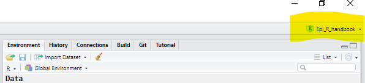
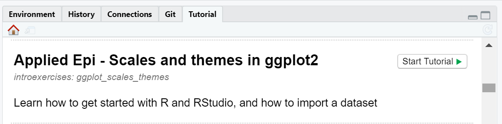
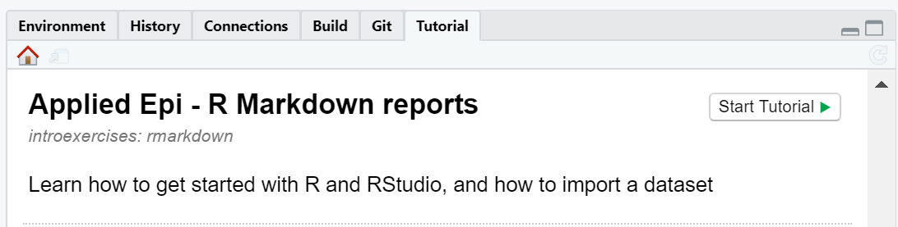

<!-- README.md is generated from README.Rmd. Please edit that file -->

# Introduction to R for Applied Epidemiology

[This website](https://appliedepi.github.io/intro_course) hosts training
materials for “Introduction to R for Applied Epidemiology”. This course
teaches the fundamentals of R for applied epidemiologists and public
health practitioners.

[**Applied Epi**](www.appliedepi.org) is a nonprofit organization
supporting frontline practitioners through open-course analytical tools,
training, and support. Our [Epidemiologist R
Handbook](www.epirhandbook.com) is a free R reference manual which has
been used by 130,000 people around the world.

# Course outline

Click here to download the course outline (PDF) TODO

# Initial setup

**When you are in the breakout session of your first module, click the
green texts below to expand and follow the step-by-step instructions:**

This first part of the course setup uses the instructions below. After
this intial setup, the exercises will be conducted entirely within
RStudio.

<!--
NOTE: Below is the hint (all within details tags collapsed)
-->

1.  Download course files

 

[**Click
here**](https://minhaskamal.github.io/DownGit/#/home?url=https://github.com/appliedepi/intro_course/tree/main/intro_course)
to download a zipped folder to use in the course exercises.

**Unzip the folder and save it on your computer’s desktop (not on a
shared drive).**

To “unzip” a folder once it is downloaded, right-click on the folder and
select “Extract All”. If offered a choice of location to save the
unzipped folder, save it to your desktop.

 

<!--
NOTE: Below is the hint (all within details tags collapsed)
-->

2.  Installing R and RStudio
    

     

Prior to this course, we sent you a guide to help you install R,
RStudio, and the important R packages for this course. If this was not
successful, please contact one of our instructors immediately.

If you already had R installed, please update to the most recent version
for the course. This involves re-installing R.

 

<!--
NOTE: Below is the hint (all within details tags collapsed)
-->

3.  Understand R
    

     

When you install R to your computer, it is an independent software that
you can open directly. If you open only R (not RStudio), you will see
only one simple panel - the R Console. **This is not how most people use
R**. Using R this way will run all the computations and create all the
plots you desire, *but it will be difficult to stay organized*.

**Now, people use Integrated Development Environments (IDE) such as
RStudio** to “wrap around” their R software, allowing a more friendly
user interface and file organization. RStudio is offered for free by the
RStudio corporation.

**Opening RStudio will automatically open R *within* RStudio.**

you can think that **R is the engine of a vehicle**, doing the crucial
work, and that **RStudio is the body of the vehicle** (with seats,
accessories, etc.) that helps you actually use the engine to move
forward!  
 

<!--
NOTE: Below is the hint (all within details tags collapsed)
-->

4.  Understand RStudio Projects
    

     

Most of the time when you use R, it will make your life drastically
easier to organize your work within an RStudio project.

An RStudio project is a **self-contained and portable R working
environment** - effectively a folder for all the files associated with a
distinct project (data files, R scripts, outputs, etc.).

-   You can zip an RStudio project and email it to someone else. They
    should be able to open it and replicate your work exactly!  
-   An RStudio project can be linked to a repository on version-control
    software like Git/Github

Working in an R project makes it much easier to organize your files and
to share your work with others.

If you are working in an RStudio project, you will see the name of the
project indicated in the upper-right corner of RStudio. If you are not
in an RStudio project, it will read “Project: (None)”.

**What do you see in your RStudio?**

 

<!--
NOTE: Below is the hint (all within details tags collapsed)
-->

5.  Create a new RStudio project
    

     

<!-- -->

1)  In RStudio click *File -\> New Project*. In the pop-up window,
    select **“Existing directory”**.

2)  Give your project the name “intro_course”. This will be the project
    for ALL of your work in this course.

3)  Click “browse” and select the “intro_course” folder on your desktop,
    that you downloaded earlier, which contains the course materials.

4)  Click “Create project”

Voila! This new RStudio window should look very similar to your old one.
Check to see that the upper-right corner of this new RStudio shows that
it is in the “intro_course” RStudio project.

 

<!--
NOTE: Below is the hint (all within details tags collapsed)
-->

6.  Explore your new RStudio project
    

     

**Close RStudio and open your File Explorer.** Navigate to the
“intro_course” folder that you saved on your desktop, where you saved
the R project.

The contents of the folder should look similar to this:

In the folder, you should see a small file with an icon that looks like
an “R box” - this is the RStudio project file (.Rproj).

**To directly open the project next time, simply double-click this
RStudio project file to open it. RStudio will open, and all your files
for this project will be at-the-ready.**

**Now, double-click the RStudio Project file** to re-open your
“intro_course” project. RStudio should open.

Observe in the “Files” RStudio pane (lower-right) that you can also see
and access the contents of the “intro_course” project.

You can read more about RStudio projects in [this chapter of the Epi R
Handbook](https://epirhandbook.com/en/r-projects.html).

 

<!--
NOTE: Below is the hint (all within details tags collapsed)
-->

7.  Download Applied Epi course exercises
    

     

The rest of the course will utilize the R package {learnr} to provide
interactive exercises *within* your RStudio window. To access these
custom exercises, follow these instructions below. If you need help,
notify your breakout facilitator.

**Copy and paste this command into your R Console as shown below, then
press the “Enter” key to run the command:**

**`remotes::install_github("appliedepi/introexercises", dep = TRUE, force = TRUE)`**

Text will begin to appear in the Console, below the command. Do not
worry, R is simply downloading the tutorials from the internet and
printing updates. *Watch the print-out for any questions that R may ask
you:*

-   If you see a printed warning about needing “RTools”, do not worry.
    This is simply a warning message and the install should proceed
    without error.  
-   If prompted to update some R packages, select “All” to update all of
    the packages.  
-   If you continue to be prompted for package updates, you can select
    “None” and continue without further updates.

**Once the download is complete, close and re-open your RStudio
project** (remember to re-open it by clicking the icon within your
“intro_courses” folder).

 

# Accessing course exercises

Once you have completed the initial setup, all further breakout
instructions will appear in Applied Epi interactive exercises, *within
your RStudio window*. Each course module has a specific corresponding
exercise.

You can access these exercises through the “Tutorials” pane in RStudio
(upper-left). Watch the gif below that introduces you to the exercise
environment (you do not need to follow the steps shown right now).

**The first module’s tutorial is called “Applied Epi - R Setup, syntax,
data import”**. To open it:

1)  Click on the “Tutorial” tab in the upper-right RStudio pane (which
    also contains a tab holding your “Environment”).  

-   The first time, you may need to restart RStudio for the Applied Epi
    exercises to appear.

2)  Select the exercise (the full list of exercise names are below -
    look for the name “Applied Epi”). For Module 1, the exercise is
    called “Applied Epi - R setup, syntax, data import”.

-   The exercise will load. Once you see the Applied Epi logo appear in
    the Tutorials pane, you can begin the exercise.  
-   You can view the exercise in this pane, or click the small icon in
    the upper-left to pop-out into a separate window.

# Modules

<!-- badges: start -->
<!-- badges: end -->

## Module 1: Introduction to R

We welcome you to the course and dive into the basics of how to interact
with R and RStudio, basic R syntax, and how to organize your analytical
projects. Finally, we cover R functions and packages, and introduce the
core functions used to import data. Using these, we import the Ebola
case study surveillance linelist, and begin to inspect and review it.

-   [Slides: Welcome, course logistics, RStudio, and basic R
    syntax](https://appliedepi.github.io/intro_course/modules/module_1/slides/course_introduction/slides_course_introduction.html)

-   Live demonstration ([instructor
    guide](https://appliedepi.github.io/intro_course/modules/module_1/guides/rstudio_tour.html))

-   Exercise:

## Module 2: Data cleaning

Now that we have our surveillance linelist in R, we cover what “data
cleaning” steps are necessary and how to execute these in R. Along the
way, we introduce many of the core R functions including adjusting
column names, deduplicating and filtering rows, selecting and modifying
columns, recoding values, and more. Together, we write a sequence of
“pipes” to clean the linelist step-by-step in a clear, reproducible
manner… so that our dataset is ready for preliminary analysis!

-   [Slides: Tidy data and data
    cleaning](https://appliedepi.github.io/intro_course/modules/module_2/slides/slides_cleaning_dplyr/slides_cleaning_dplyr.html)

-   Exercise:

## Module 3: Grouping data and making summary tables

Informative tables are the bedrock of epidemiological and public health
practice. In this module we introduce three tools to produce tables of
summary statistics: {dplyr} for flexibility, {janitor} for speed, and
{gtsummary} for beauty. Finally, we explore {flextable}, which can be
used to beautiful any of the above approaches, add selecting colors and
highlights, and save tables to Word, PNG, HTML, etc.

-   [Slides: Grouping and summarizing
    data](https://appliedepi.github.io/intro_course/modules/module_3/slides/slides_summary_tables/slides_grouping_summaries.html)

-   Exercise:

## Module 4: Data visualization with {ggplot2}

Using the {ggplot2} package to maximum effect rests upon understanding
how to apply its “grammar of graphics” to build a plot layer-by-layer.
We tackle this piece-by-piece, introducing concepts one-by-one so that
you build upon previous knowledge to construct informative and colorful
bar plots, scatter plots, histograms, line plots, text labels that
automatically update with refreshed data (very useful for
epidemiological reports!), and more.

-   [Slides: Data visualization with
    ggplot2](https://appliedepi.github.io/intro_course/modules/module_4/slides/slides_ggplot_basics/slides_ggplot_basics.html)

-   Exercise:

-   [Slides: Scales, themes, and
    labels](https://appliedepi.github.io/intro_course/modules/module_4/slides/slides_ggplot_scales_labels/slides_ggplot_scales_labels.html)

-   Exercise:

## Module 5: Transforming data

Public health analytics rarely involves just one data set, so now we
practice joining data by adding hospital, laboratory, and case
investigation data to our surveillance linelist. We engrain best
practices for conducting joins, and prepare your for doing data
transformations independently. In the second part of this module, we
address *pivoting*, which in R means transforming data between “long”
and “wide” formats. This is particularly relevant in public health,
where each format has distinct benefits.  
- [Slides: Joining
data](https://appliedepi.github.io/intro_course/modules/module_5/slides/slides_joins/slides_joins.html)

-   Exercise:

-   [Slides: Pivoting
    data](https://appliedepi.github.io/intro_course/modules/module_5/slides/slides_pivots/slides_pivots.html)

-   Exercise:

## Module 6: More data visualization with {ggplot2}

In this second data visualization module we encourage you to practice
learning R independently (a necessary skill once you leave the class!)
but with our support. We jump in to tackle visualizations that are
central to descriptive epidemiology: the intricacies of crafting an
accurate epidemic curve, conveying three continuous variables with a
heat plot, and creating age/sex pyramids to convey demographics.

-   [Slides: Epidemic curves in ggplot2]() TODO  
-   [Slides: Heat plots in ggplot2]() TODO  
-   [Slides: Age/sex pyramids in ggplot2]() TODO  
-   [Slides: GIS
    demonstration](https://appliedepi.github.io/intro_course/modules/module_6/slides/slides_gis_demo/slides_gis_demo.html)

## Module 7: Routine reports with R Markdown

In this module, we take the R code on the Ebola case study that you have
been building throughout the course and convert it into a reproducible,
automated report (Word, PDF, HTML, etc.). We teach you the variations in
syntax and opportunties that lie in being able to produce documents that
update when incoming data is refreshed, that look professional, and can
be sent to inform public health parters and stakeholders.

-   Live demonstration [Instructor
    guide](https://appliedepi.github.io/intro_course/modules/module_7/slides/demo_rmd/demo_rmd_guide.html)

-   [Slides: R markdown and routine
    reports](https://appliedepi.github.io/intro_course/modules/module_7/slides/slides_rmd/slides_rmd.html)

-   Exercise:

## Module 8: Final exercise and code review

In this last module, your skills are tested as you have to produce an R
Markdown report using a COVID-19 case linelist. Unlike with the Ebola
case study, you will not have the answer code available to you. When you
finish, we perform “code reviews”, simultaneously improving your coding
skills and teaching you how to review others’ code. Before closing, we
touch upon how to find your particular community of R users, resources
available to you for questions, and close with a feedback survey.

-   [Slides: COVID case study]() TODO  
-   [Slides: Code review]() TODO

## Sustained support

Our instructors *know* public health. One of the signature features of
Applied Epi’s training is that we provide follow-up support to your
team, to help you apply your new skills to your work context. We
schedule 1.5-hour sessions with your team at 1 week, 2 weeks, 1 month, 2
months, and 3 months post-training. In these sessions, we help you
troubleshoot code, advise you on analytical strategies, or guide you in
new learning that you need.

## Notes

-   Please note that all of our case study training materials use *fake
    example data* in which no person is identifiable and the actual
    values have been scrambled.  
-   Modifications are possible so that the course uses data from *your*
    jurisdiction. Email us at <contact@appliedepi.org> us to discuss.

# Acknowledgements

Authors and contributors to the curriculum from **Applied Epi**
included:

-   Neale Batra  

-   Mathilde Mousset  

-   Arran Hamlet  

-   Alex Spina  

-   Paula Blomquist  

-   …

-   The Fulton County Board of Health graciously provided example data
    (anonymized and scrambled) for a case study.  

-   The {outbreaks} package formed the basis for the fake dataset in the
    Ebola case study.

# Terms of Use and License

 This
work is licensed under a
<a rel="license" href="http://creativecommons.org/licenses/by-nc-sa/4.0/">Creative
Commons Attribution-NonCommercial-ShareAlike 4.0 International
License</a>.

Please email <contact@appliedepi.org> if you could like to use these
materials for an academic course or epidemiologist training program.

# Contribution

If you would like to make a content contribution, please contact with us
first via Github issues or by email. We are implementing a schedule for
updates and are creating a contributor guide.

Please note that the Epi R Handbook project is released with a
[Contributor Code of
Conduct](https://contributor-covenant.org/version/2/0/CODE_OF_CONDUCT.html).
By contributing to this project, you agree to abide by its terms.
