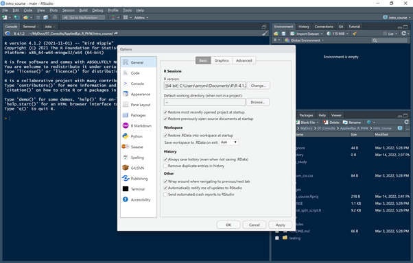

```{r, echo=FALSE, include = F}
# Put logo in upper-right of document
htmltools::img(src = knitr::image_uri(here::here("images", "logo.png")), 
               alt = 'logo', 
               style = 'position:absolute; top:0; right:0; padding:10px;',
               width = "200px",
               heigth = "200px")
```


```{r setup, include=FALSE}
knitr::opts_chunk$set(echo = TRUE)
```

# Overview

In this guide, you will find instructions to help you install R and the other software required for this course. The approach we have suggested below should not require administrator rights, as we understand that many people will be using a computer provided by their place of work, which may have restrictions on installing new software.  

We recommend that you read this guide and try to complete the installations well before the start of the course; this will allow time for troubleshooting and contacting your local IT department if necessary.     

# Preparation  

## What to install:

There are five bundles of software that you will need to install.  The first three are essential for this course, while the last two will become essential R companions once you start working with the program regularly:

   - R (this is the R program itself)
   - RStudio (this is a user-friendly *integrated development environment* for R)
   - R packages (packages contain sets of functions that you will use in R)
   - RTools (compiles R packages that have not yet been converted to windows binaries)
   - Git (a program that interfaces with Github and Gitlab version control systems)

A quick note on why each of these elements is needed:

The R program itself has a very basic user interface, in which you can write and store code as plain text files.  Most R users (from beginner to experienced alike) prefer to open and use R within RStudio, which is another program that provides a much more user-friendly interface with many powerful features to help limit errors in your code and run automated reports, to name a few. You can read more about R and RStudio in the [R basics chapter of the Epidemiologist R handbook](https://epirhandbook.com/en/r-basics.html).

Over time, thousands of R users have created new R functions; these are normally grouped together and made available to other users in downloadable *packages*. Each package contains a set of functions to deal with a specific task or type of analysis.  This makes R highly customisable, because you can choose the packages that are relevant to your work and the type of analysis that you are doing. You can read more about R packages [here](https://epirhandbook.com/en/suggested-packages-1.html).


## Installation order:

You will need to install everything in the following order:

  1. Create a folder called `R` in the `My documents` folder on your computer  
  2. Install the R program in this folder
  3. Unzip RStudio in the same folder
  4. Create a short-cut to `RStudio.exe` in the task bar or on your desktop
  4. Open RStudio and follow the instructions below to install the necessary packages.


# Permissions and Network drives

Many workplaces have restrictions on computers and other devices, to prevent installation of malicious or virus-contaminated software.  Unfortunately, this can often place restrictions on the download and installation of work-related software too.

At the most basic level of restriction, installing a program from an executable file in the `Programs` folder on a PC will require that you log in as an administrator before proceeding.  

## Installing R without administrator rights:

Fortunately, as many R users face this problem, it is possible to install R in the `My documents` folder on your computer instead.  This is a folder that you have personal access to and does not require administrator rights.  The file path to this folder on a PC will be something like this:

```{r, message=FALSE, warning=FALSE, eval=FALSE}

C:\Users\your_username\Documents

```

We suggest you create a new folder called `R` in this location and install R, RStudio and any other R-related software there.  Installing them in the same folder will ensure that RStudio is able to 'find' R (it will not work without it).


## Installing RStudio without administrator rights:

RStudio requires a different approach as the default setting for the installer is to install it in the `Program files` folder.  Fortunately, as again this is a problem many people face, RStudio is available to download in several different formats.  The format which will work best if you don't have administrator rights is the `.zip` file.  This is actually a pre-compiled, compressed version of RStudio which is ready to use once unzipped.  You can use `7-zip` or any other unzip program to unzip it.


## Caveats:

Installing programs outside the `Program files` folder on a PC means that certain features which would automatically be activated need to be performed manually.  The two main ones are listed below:

   - Putting a link to RStudio in the start menu, task bar, or desktop
   - Associating file endings with RStudio

The instructions below explain how to adjust these settings manually.


## What if I can't even download R or RStudio?

Some IT restrictions are even more limiting in that they will detect attempts to download `.exe` and `.zip` files from your web browser and block them.  If this happens to you, in the first instance try a different browser (e.g. try Google Chrome instead of Microsoft Edge).  If that doesn't help, it is advisable to contact your IT department and ask them to help you install R and RStudio.  If possible, ask a colleague who already uses R in your institution if there are any specific requirements that need to accompany your IT request.  

It is worth noting that when this level of restriction is applied, large institutions often have a **software download center** where you can download and install popular work software that has been pre-approved.  R and RStudio are increasingly being included in these download centers, but be aware that they may not have the latest version.  R and RStudio are regularly being updated and improved, and new versions with major revisions come out every 6 months or so.  For this reason, it is advisable to contact your IT department and ensure that the latest versions are in the software download center before installing.  This is a consideration for updating R too.

If you have difficulties accessing IT support, as an interim measure you could download R and RStudio on an non-work computer and transfer them to your work computer on a USB.  Be aware, however, that some systems may still stop R from installing with this method.


## RStudio on a server:

Some institutions may make R and RStudio available to you on a central server.  The idea behind this is that R and RStudio are then available to everyone.  There are some caveats to this however:

   - If you are offline due to poor or no internet connection, you will not be able to use R
   - The R and RStudio versions available on the server may not be the latest ones
   - You may not have rights (or have limited rights) to install R packages on the server

If this is your situation, it is advisable to contact your IT department and ask them to help you install R and RStudio on your own PC.  This will give you more flexibility and you can work off-line.  However if in the future you plan to analyse very large data sets, R on a server may be more appropriate as extra memory can be allocated.


# Detailed installation instructions

Step-by-step installation instructions have been provided below, along with some screenshots.


# R

## Downloading R:

The latest version of R can be downloaded from the [Comprehensive R Archive Network (CRAN)](https://cran.r-project.org/) website.  Here you can choose the version of R appropriate for your computer's operating system (Windows, MAC or Linux):


Once you have selected the appropriate version of R for your operating system, clicking on the link will bring you to the next page, where you can choose the suite of packages that will be installed along with R. Normally choosing `base` will be sufficient (highlighted in red in the image below); other packages can be installed later.


Next, click on the `base` link to start downloading R.  If successful, you should see the downloaded R installer executable (.exe) file in your browser window:


Note: if the download fails, this may be because executable files (ending in `.exe`) have been blocked by your institute's firewall.  In this case, ask your IT department to download the latest version of R for you and proceed to the next section.

## Installing R:

To begin, double-click on the executable file that you downloaded in the last section.  At this stage, depending on the settings on your computer, you may be asked to log in as an administrator before proceeding.  If this is the case for you, ask your IT department for assistance.  They may be able to log in remotely and allow you to complete the install yourself, or alternatively they may prefer to complete the installs on your behalf.

If you see a message asking if you would like to make changes to your computer, click `ok`.  This will bring up the first dialogue window in the installer, which allows you to select the language from the dropdown menu. In this example we will leave it on the default setting (English):


R is distributed with a GNU general public licence.  In the next dialogue box you will be invited to read and accept the licence conditions (click `next` when done):


In the next dialogue box, you will be asked to choose where to install R on your computer.  The default location is in the `Program Files` folder; however if you do not have administrator rights on your computer you will not be able to install R there.  We therefore suggest that you create a new folder called `R` in your `My Documents` folder and install R there instead.  You do not need administrator rights to install software in this folder.


Once the destination folder is selected, the installer will automatically create a new sub-folder with the name of the R version to install and append this to the destination file path. Click `next` when done.

In the next dialogue box you can choose which elements of R you want to install.  We suggest leaving this on the default setting (which will install everything):


Note that this will install both *32-bit* and *64-bit* versions of R on your system.  This is useful because many Microsoft Windows installations come with 32-bit Office programs as default.  If you want to query or import data from a 32-bit Microsoft Access database, you will need to do this from 32-bit R.  For everything else, 64-bit R is faster and has better memory allocation.

Next, you can choose whether to accept the default startup options, or customize them.  Unless you are an advanced user and/or have some specific requirements, we recommend that you select the default setting:


Next, choose whether you would like to add a shortcut to R in your computer's start menu (note: while we have left this on the default setting - to create a shortcut - this is actually not necessary since most of the time you will be opening R files and interacting with R through RStudio).


Next, you can choose whether to create other shortcuts to R - as above, bear in mind that most interactions with R will be through RStudio, so a shortcut to the R program itself is generally not necessary.  This dialogue box will also ask you if you want to save the version number of R in the registry (we recommend you do in case you want to run more than one version of R on the same computer - sometimes this is necessary when upgrading R to check that code still works). We also suggest you associate R with .RData files (these are the files created when you save your work space in R). 


Click `next` when done - if the installation has been succesful, this should bring you to the installation complete screen:


# RStudio

Once you have installed R, you will need to download and install RStudio.

## Downloading RStudio:

The latest version of RStudio can be downloaded from the [RStudio website](https://www.rstudio.com/products/rstudio/download/).  You will note there are several different versions; the free versions appear under the `RStudio desktop` header.  To avoid difficulties with installation if you don't have administrator rights to your computer, we recommend downloading the pre-compiled zip or tarball versions, which you can find at the bottom of this web page. The relevant version for Windows 10/11 is highlighted in the red box in the figure below:


## Installing RStudio:

Once downloaded, you will need to unzip the file, selecting the `R` folder in `My Documents` that you created in the previous section as the destination.  It is important that both R and RStudio are in the same folder so that RStudio can automatically locate R on start-up.  RStudio will be unzipped to a folder with the version number in the title, as shown below:


Next, you will need to locate the RStudio executable and create a shortcut to it on your task bar or on the desktop; note that this does not happen automatically when using the zipped version as opposed to an installer. `RStudio.exe` should be in a sub-folder called `bin` as shown in the figure below:


## Testing the installations:

Now that both R and RStudio have been installed, you may wish to open RStudio and check that:

  1. The shortcut points to the correct (latest) version of RStudio (in case of previous installs)
  2. R is located and successfully opened on start-up;
  3. The correct (latest) version of R is opened (in case of previous installs)
  
The first and third checks are particularly important if you already have previous versions of R or RStudio on your computer.  

The R version will be printed in the RStudio console at start-up, while to check the RStudio version you will need to click on the `Help` menu at the top of the RStudio window and then select `About RStudio`.  This will bring up a display box with full details of the RStudio version as shown below: 


If you find that RStudio is connected to an older version of R, you can change this by going to the `Tools` menu at the top of the RStudio window and clicking on `Global options` (at the bottom).  This will bring up a dialogue box where you can change different features of RStudio.  At the top of the `General` tab in this dialogue box, you will see the R version, as shown in the image below:





Clicking on the `change` button next to this will open another dialogue box that lists all the R versions that RStudio has been able to locate. If you don't see the desired R version in the list, this may mean it was installed in a different location to RStudio; in this case you can click on the `browse` button to manually locate the `RStudio.exe` file.


You will also note that for Windows operating systems, both 32-bit and 64-bit versions of R are listed; we would recommend you choose the 64-bit version and only change to the 32-bit version if you need to interact with 32-bit Microsoft Access databases.

At the time of writing (`r format(Sys.Date(), "%d %B %Y")`) the latest versions are:

   - **R:** v 4.1.3 (22-03-10) "One Push-up"
   - **RStudio:** 2022.02.0 Build 443

Finally, another way of checking your version of R, the operating system, the language locale and any R packages that you have loaded is to run the `sessionInfo()` command in the RStudio console and look at the output:


# R Packages

As mentioned in the introduction, the R software that you just installed comes with some basic packages containing functions that nearly everyone needs to use.  However, there are many more packages available in public repositories such as the Comprehensive R Archive Network (CRAN), Bioconductor and GitHub.  

During this course, we will be using some of these additional packages, which have functions specific to data cleaning, analysis or imaging tasks.  

The packages can be installed from within RStudio.  For convenience, we have created an R script which will install all the necessary packages when you run it.

To run the script, you will first need to open RStudio.  Next, go to `File` on the menu at the top of RStudio and select `Open File...`.  This will bring up a dialogue box where you can browse and select the R script entitled `packages_to_install.R`.

This file will open in a new tab within RStudio (normally located on the top left).  You will see a number of buttons at the top of this new tab; on the top right-hand side there is a button called `Run` with a downward-facing arrow next to it.  Clicking on the arrow will reveal a drop-down menu; if you select the last option on this menu (`Run all`) it will run the whole script and install all the necessary packages.  

An alternative way of running this script is to highlight all the text, then press `Ctrl + enter` (at the same time) on your keyboard (taking care not to delete or replace the text!).

To run this script and install the packages successfully, you will need a good internet connection. It will take several minutes and during this process you will see a lot of status messages in the R console.  If you see any error messages or encounter any difficulties, please contact the course organizer, who will organize a 1-to-1 session to help you complete the package installations. 

For convenience, we have also included a copy of the package installation script below.  If you are comfortable with installing packages, you can also copy and paste this script directly into the console in RStudio and press enter to run it.


```{r, message=FALSE, warning=FALSE, eval=FALSE}
#############################################################
# Essential R packages: Intro to R for Applied Epidemiology #
#############################################################

# This script uses the p_load() function from pacman R package, 
# which installs if package is absent, and loads for use if already installed


# Ensures the package "pacman" is installed
if (!require("pacman")) install.packages("pacman")


# Packages available from CRAN
##############################
pacman::p_load(
     
     # learning R
     ############
     learnr,   # interactive tutorials in RStudio Tutorial pane

     # project and file management
     #############################
     here,     # file paths relative to R project root folder
     rio,      # import/export of many types of data
     openxlsx, # import/export of multi-sheet Excel workbooks 
     
     # package install and management
     ################################
     pacman,   # package install/load
     remotes,  # install from github
     
     # General data management
     #########################
     tidyverse,    # includes many packages for tidy data wrangling and presentation
          #dplyr,      # data management
          #tidyr,      # data management
          #ggplot2,    # data visualization
          #stringr,    # work with strings and characters
          #forcats,    # work with factors 
          #lubridate,  # work with dates
          #purrr       # iteration and working with lists
     epitrix,      # Useful epi functions

     
     # statistics  
     ############
     janitor,      # tables and data cleaning
     gtsummary,    # making descriptive and statistical tables
     rstatix,      # quickly run statistical tests and summaries

     # plots - general
     #################
     #ggplot2,         # included in tidyverse
     cowplot,          # combining plots  
     RColorBrewer,     # color scales
     incidence2,       # Make epicurves and handle incidence data
     i2extras,         # Extra functions for the incidence2 package
     gghighlight,      # highlight a subset
     ggrepel,          # smart labels
     ggExtra,          # fancy plots  
     scales,           # helper functions
     apyramid,         # age and sex pyramids

     # routine reports
     #################
     rmarkdown,        # produce PDFs, Word Documents, Powerpoints, and HTML files
     reportfactory,    # auto-organization of R Markdown outputs
     officer,          # powerpoints
     
     # dashboards
     ############
     flexdashboard,    # convert an R Markdown script into a dashboard
  
     # tables for presentation
     #########################
     knitr,            # R Markdown report generation and html tables
     flextable        # HTML tables
     #DT,              # HTML tables (alternative)
     #gt,              # HTML tables (alternative)
     #huxtable,        # HTML tables (alternative) 

)

#####################################################
# Packages required to install external dependencies:
#####################################################
     
# tinytex (required for printing R markdown reports to .pdf):
install.packages("tinytex")
tinytex::install_tinytex()

# webshot (required for printing HTML images to Microsoft Word or .pdf):
install.packages("webshot")
webshot::install_phantomjs()

#####################################################

```


# Rtools:

Rtools is a separate piece of software which allows users to create and compile packages.  It is useful to have installed even as a beginner, because sometimes the latest versions of packages on CRAN have not yet been bundled into a format that can be easily installed on a windows operating system.  Sometimes R users will create packages and put them on the public repository GitHub - again these are unlikely to have been converted to a windows-friendly format, so Rtools will be needed to install them.

Once installed in the correct location, Rtools is automatically called by R when needed, so you do not need to interact with it directly.

Rtools can be downloaded from the [CRAN website](https://cran.r-project.org/bin/windows/) by clicking on the `Rtools` link on this web page:


Double-click on the installer to run it and as before, we recommend you choose the `R` folder in `My Documents` (where you also installed R and RStudio) as the install location, when prompted.


# Git

GitHub and Gitlab are version control systems and public (or institutional) repositories hosted on the web where you can store and share R code that you have created.  To upload and download code to either of these repositories and make full use of the version control functions, you will need to install the companion software, `Git`.  Although we won't cover the use of Git version control systems in this course, you may wish to use this later on and you can read more about it in the [version control chapter](https://epirhandbook.com/en/version-control-and-collaboration-with-git-and-github.html) of the Epidemiologist R handbook.

Git can be downloaded from the Git website [here](https://git-scm.com/download/win). Note there are two options, either an installer (which will require administrator rights) or the `thumb-drive (portable)` edition.  We recommend that if you don't have administrator rights to your computer, you download the thumb-drive edition.  As with RStudio, this is a zip file that is ready to use once unzipped.  


Note that Git needs to interact with any file on your computer that contains code that you want to upload to a repository; for this reason we recommend checking that it is set up correctly with an experienced user before trying it. 


# Wrap-up

If you have successfully installed all the software in this guide, you are ready to begin and we wish you well on your R learning journey!  If you have any difficulties, please don't hesitate to contact the course organzer or designated point of contact and we will organize a session to help you.  We do recommend that you attempt installations sufficiently in time before the course, so that we can help troubleshoot if needs be.


